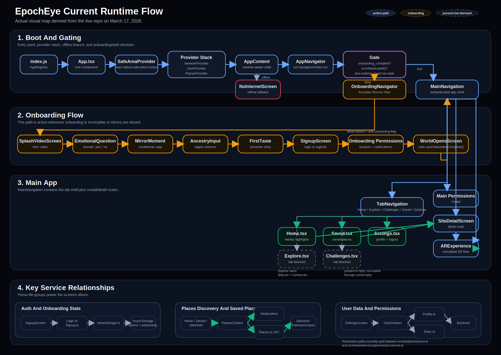
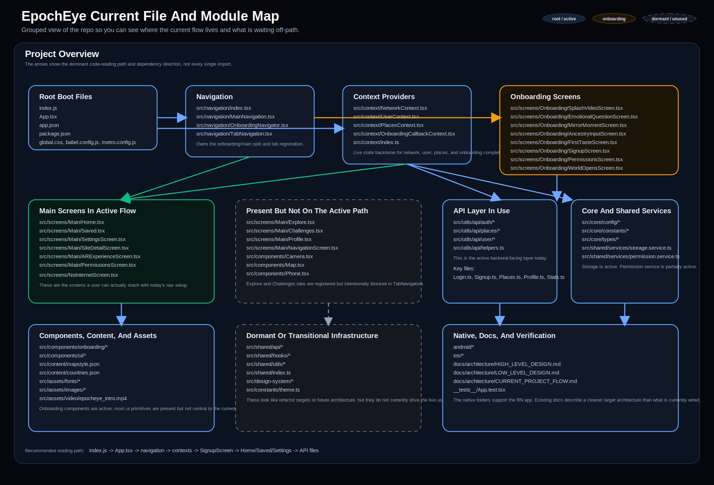
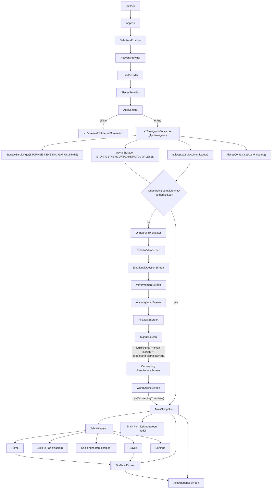
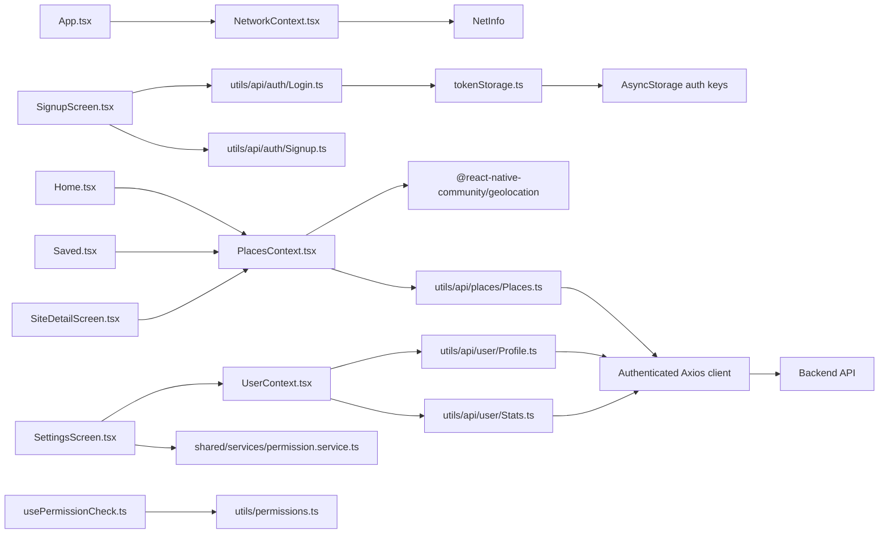
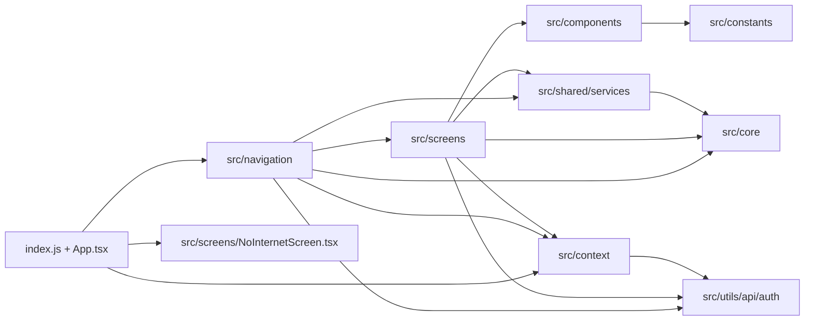

# EpochEye Current Project Flow

Scanned on March 17, 2026 from the current codebase.

This document reflects the live implementation in the repo today. It is meant to complement the older [HIGH_LEVEL_DESIGN.md](./HIGH_LEVEL_DESIGN.md) and [LOW_LEVEL_DESIGN.md](./LOW_LEVEL_DESIGN.md), which are partly aspirational and no longer fully match the runtime wiring.

Mermaid blocks below should render in Markdown preview.

## Visual Maps

Open these directly if your Markdown preview does not inline SVGs:

- [CURRENT_RUNTIME_FLOW.svg](./CURRENT_RUNTIME_FLOW.svg)
- [CURRENT_FILE_MODULE_MAP.svg](./CURRENT_FILE_MODULE_MAP.svg)

### Runtime SVG



### Module SVG



## Scan Snapshot

- 106 JS/TS app files were scanned across the root app files, `src/`, and tests.
- 66 files are reachable from the runtime entry path: `index.js -> App.tsx`.
- 28 `src/` files are currently present but not on the active runtime path.
- The live user path is: boot -> provider stack -> onboarding/auth gate -> main tabs -> site detail -> simulated AR flow.

## Runtime Flow



## State And Service Flow



## Layer And Folder Graph



## File Map

### Root Boot And Tooling

```text
index.js
App.tsx
app.json
package.json
package-lock.json
global.css
babel.config.js
metro.config.js
tailwind.config.js
tsconfig.json
react-native.config.js
jest.config.js
env.d.ts
nativewind-env.d.ts
gesture-handler.js
gesture-handler.native.js
README.md
CLAUDE.md
```

### App Runtime Files

```text
src/navigation/
  index.tsx
  MainNavigation.tsx
  OnboardingNavigator.tsx
  TabNavigation.tsx

src/context/
  index.ts
  NetworkContext.tsx
  UserContext.tsx
  PlacesContext.tsx
  OnboardingCallbackContext.tsx

src/screens/Onboarding/
  SplashVideoScreen.tsx
  EmotionalQuestionScreen.tsx
  MirrorMomentScreen.tsx
  AncestryInputScreen.tsx
  FirstTasteScreen.tsx
  SignupScreen.tsx
  PermissionsScreen.tsx
  WorldOpensScreen.tsx

src/screens/Main/
  Home.tsx
  Explore.tsx
  Challenges.tsx
  Saved.tsx
  SettingsScreen.tsx
  SiteDetailScreen.tsx
  ARExperienceScreen.tsx
  PermissionsScreen.tsx
  NavigationScreen.tsx
  Profile.tsx

src/screens/
  NoInternetScreen.tsx
  index.ts
```

### Components And Content

```text
src/components/
  Camera.tsx
  Map.tsx
  Phone.tsx

src/components/onboarding/
  AmberButton.tsx
  AncestryCard.tsx
  AuthButton.tsx
  DustMotes.tsx
  GhostButton.tsx
  MonumentCard.tsx

src/components/ui/
  Button.tsx
  Checkbox.tsx
  Input.tsx
  index.ts

src/constants/onboarding/
  ancestorStories.ts
  regions.ts

src/content/
  countries.json
  mapstyle.json
```

### API, Services, Shared Logic, And Types

```text
src/utils/
  permissions.ts
  usePermissionCheck.ts
  api/helpers.ts

src/utils/api/auth/
  index.ts
  Login.ts
  Signup.ts
  tokenStorage.ts
  types.ts

src/utils/api/places/
  index.ts
  Places.ts
  types.ts

src/utils/api/user/
  index.ts
  Profile.ts
  Stats.ts
  types.ts

src/shared/services/
  index.ts
  permission.service.ts
  storage.service.ts

src/shared/api/
  client.ts
  error-handler.ts
  index.ts

src/shared/hooks/
  index.ts
  useAsync.ts
  useDebounce.ts
  useGeolocation.ts
  useMounted.ts

src/shared/utils/
  formatters.ts
  geo.utils.ts
  index.ts
  validators.ts

src/shared/
  index.ts

src/core/config/
  index.ts
  api.config.ts
  app.config.ts

src/core/constants/
  index.ts
  error-messages.ts
  routes.ts
  storage-keys.ts

src/core/types/
  index.ts
  common.types.ts
  navigation.types.ts

src/core/
  index.ts
```

### Design System, Assets, Docs, Native, And Tests

```text
src/design-system/
  index.ts
  tokens/
    colors.ts
    index.ts
    spacing.ts
    typography.ts

src/constants/
  theme.ts

src/assets/
  fonts/*
  images/
    Google.webp
    bg.webp
    logo-black.png
    logo-white.png
    vector.png
  video/
    epocheye_intro.mp4

docs/
  REFACTORING_SUMMARY.md
  architecture/
    HIGH_LEVEL_DESIGN.md
    LOW_LEVEL_DESIGN.md
    CURRENT_PROJECT_FLOW.md

__tests__/
  App.test.tsx

android/*
ios/*
```

## What Is Active Vs Present

### Active Runtime Path

- `index.js`, `App.tsx`, `src/navigation/*`, `src/context/*`, `src/screens/Onboarding/*`, `src/screens/Main/Home.tsx`, `src/screens/Main/Saved.tsx`, `src/screens/Main/SettingsScreen.tsx`, `src/screens/Main/SiteDetailScreen.tsx`, `src/screens/Main/ARExperienceScreen.tsx`, `src/screens/Main/PermissionsScreen.tsx`.
- Active API layer is `src/utils/api/*`.
- Active storage and navigation persistence path uses `src/shared/services/storage.service.ts`.
- Active onboarding completion gate uses `STORAGE_KEYS.ONBOARDING.COMPLETED` plus auth token presence.

### Present But Not Fully Wired

- `src/screens/Main/Explore.tsx` exists, but the Explore tab is blocked by `preventDefault()` and a "Coming Soon" overlay in `src/navigation/TabNavigation.tsx`.
- `src/screens/Main/Challenges.tsx` exists, but the Challenges tab is also blocked in `src/navigation/TabNavigation.tsx`.
- `src/components/Camera.tsx` and `src/components/Map.tsx` are only reachable through `Explore.tsx`, so they are effectively dormant in normal navigation.
- `src/screens/Main/NavigationScreen.tsx` exists and a route constant exists, but nothing currently navigates to it.
- `src/screens/Main/Profile.tsx` exists, but it is not registered in the live navigators.
- `src/components/Phone.tsx`, `src/components/ui/*`, much of `src/shared/{api,hooks,utils}`, and much of `src/design-system/*` are currently outside the runtime path.

### Architectural Drift To Be Aware Of

- There are two permission stacks in use:
  - `src/utils/permissions.ts` + `src/utils/usePermissionCheck.ts`
  - `src/shared/services/permission.service.ts`
- There are two API/helper layers:
  - Active: `src/utils/api/*`
  - Largely dormant: `src/shared/api/*`
- `ARExperienceScreen.tsx` is a simulated AR flow and is not currently wired to `src/components/Camera.tsx`.
- Existing HLD/LLD docs describe a cleaner target architecture than the one currently running.

## Best Files To Read First

If you want the fastest understanding path through the app, read these in order:

1. `index.js`
2. `App.tsx`
3. `src/navigation/index.tsx`
4. `src/navigation/OnboardingNavigator.tsx`
5. `src/navigation/MainNavigation.tsx`
6. `src/navigation/TabNavigation.tsx`
7. `src/context/PlacesContext.tsx`
8. `src/context/UserContext.tsx`
9. `src/screens/Onboarding/SignupScreen.tsx`
10. `src/screens/Main/Home.tsx`
11. `src/screens/Main/Saved.tsx`
12. `src/screens/Main/SettingsScreen.tsx`
13. `src/screens/Main/SiteDetailScreen.tsx`
14. `src/utils/api/auth/Login.ts`
15. `src/utils/api/places/Places.ts`
16. `src/utils/api/user/Profile.ts`
