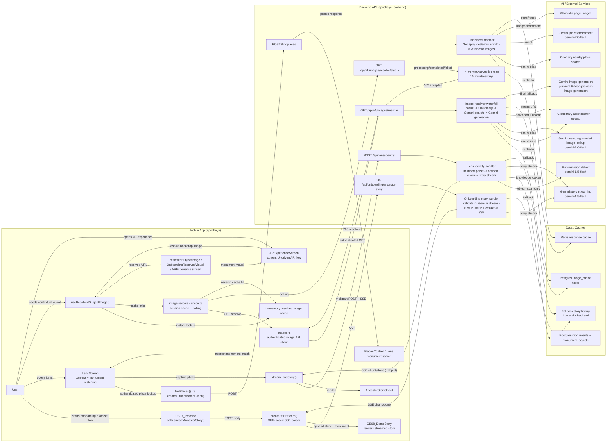

# EpochEye AR + AI Workflow Documentation

Public APIs unchanged; documentation only.

This document describes the implemented AR-adjacent and AI-assisted workflows across the mobile app in `e:\epocheye` and the backend service in `e:\epocheye_backend`. It covers the live pipelines that exist today in source code, not future or placeholder AR behavior.

## Overview

### System actors

- Mobile app: React Native client that triggers story generation, image resolution, place discovery, and Lens capture flows.
- Backend API: Go service that exposes onboarding, Lens, image resolution, and place discovery routes.
- Gemini: used for streamed story generation, Lens object detection, place enrichment, search-grounded image lookup, and image generation fallback.
- Cloudinary: searched for existing images and used to store normalized/generated image assets.
- Neon or Postgres: stores image cache records and monument knowledge used by Lens object matching.
- Redis: caches nearby-place responses for repeated geospatial lookups.
- Geoapify: primary nearby-place search provider.
- Wikipedia: secondary place-image enrichment source for nearby places.

### Current scope note

- The live AI scan pipeline is implemented in [LensScreen](/e:/epocheye/src/screens/Lens/LensScreen.tsx).
- [ARExperienceScreen](/e:/epocheye/src/screens/Main/ARExperienceScreen.tsx) currently uses `useResolvedSubjectImage()` to fetch contextual monument imagery and presents a UI-driven scan/experience flow. It does not call `/api/lens/identify`.

### Primary diagram

Diagram source: [ar-ai-pipeline.mmd](/e:/epocheye/docs/architecture/ar-ai-pipeline.mmd)

## Frontend Workflow Map

### 1. Onboarding ancestor story flow

- [OB07_Promise](/e:/epocheye/src/screens/Onboarding/OB07_Promise.tsx) starts the request on mount.
- It calls [streamAncestorStory](/e:/epocheye/src/services/ancestorStoryService.ts), which packages onboarding answers and sends them through [createSSEStream](/e:/epocheye/src/services/sseStreamService.ts).
- Story chunks are appended into the onboarding store, and the final monument is stored separately.
- [OB08_DemoStory](/e:/epocheye/src/screens/Onboarding/OB08_DemoStory.tsx) renders the streamed story text and resolves the monument visual through [ResolvedSubjectImage](/e:/epocheye/src/components/ui/ResolvedSubjectImage.tsx).

### 2. Resolved subject image flow

- [useResolvedSubjectImage](/e:/epocheye/src/shared/hooks/useResolvedSubjectImage.ts) is the shared entry point.
- It first checks the in-memory session cache in [image-resolve.service.ts](/e:/epocheye/src/shared/services/image-resolve.service.ts).
- On a miss, it calls [Images.ts](/e:/epocheye/src/utils/api/images/Images.ts), which uses authenticated GET requests against `/api/v1/images/resolve` and `/api/v1/images/resolve/status`.
- The resolved URL is then consumed by:
  - [ResolvedSubjectImage](/e:/epocheye/src/components/ui/ResolvedSubjectImage.tsx)
  - [OnboardingResolvedVisual](/e:/epocheye/src/components/onboarding/OnboardingResolvedVisual.tsx)
  - [ARExperienceScreen](/e:/epocheye/src/screens/Main/ARExperienceScreen.tsx)
  - [Home](/e:/epocheye/src/screens/Main/Home.tsx)
  - [SiteDetailScreen](/e:/epocheye/src/screens/Main/SiteDetailScreen.tsx)

### 3. Lens monument detection and object scan flow

- [LensScreen](/e:/epocheye/src/screens/Lens/LensScreen.tsx) opens the camera via `react-native-vision-camera`.
- It uses [findPlaces](/e:/epocheye/src/utils/api/places/Places.ts) with multiple radii to locate the nearest nearby place.
- Once a place is matched, the user can:
  - open a monument story in `monument` mode
  - scan a specific object in `object_scan` mode
- [streamLensStory](/e:/epocheye/src/services/lensStoryService.ts) uploads the captured image as multipart form data and consumes backend SSE events.
- Streamed text and any identified object metadata are displayed in [AncestorStorySheet](/e:/epocheye/src/screens/Lens/components/AncestorStorySheet.tsx).

### 4. AR experience visual flow

- [ARExperienceScreen](/e:/epocheye/src/screens/Main/ARExperienceScreen.tsx) calls `useResolvedSubjectImage()` using the selected site name and a context string.
- The returned image is used as the experience backdrop for tutorial, scan, and feature modal states.
- The current screen simulates scan progress locally. It does not trigger backend vision detection.

## Backend Workflow Map

### Route registration

The backend registers the relevant routes in [main.go](/e:/epocheye_backend/main.go):

- `POST /api/onboarding/ancestor-story`
- `POST /api/lens/identify`
- `POST /findplaces`
- `GET /api/v1/images/resolve`
- `GET /api/v1/images/resolve/status`

Auth behavior in the current implementation:

- `/findplaces` and `/api/v1/images/*` are wrapped with auth middleware.
- `/api/onboarding/ancestor-story` and `/api/lens/identify` are currently mounted without auth middleware.

### Onboarding story generation

- [AncestorStoryHandler](/e:/epocheye_backend/apis/onboarding/handler.go) validates `firstName` and `regions`.
- It resolves a region-based fallback monument before making any model call.
- It builds a Gemini streaming request against `gemini-1.5-flash:streamGenerateContent`.
- The handler buffers the full Gemini stream, extracts the `MONUMENT:` line, then re-streams the story to the client as EpochEye SSE chunk events.
- If Gemini is unavailable, invalid, incomplete, or times out, the handler streams a fallback story instead.

### Image resolution waterfall

- [ResolveHandler](/e:/epocheye_backend/apis/images/handler.go) gives the synchronous path up to 8 seconds.
- [resolveImage](/e:/epocheye_backend/apis/images/resolver.go) executes this waterfall:
  1. normalize subject to cache key
  2. lookup Postgres `image_cache`
  3. search Cloudinary for an existing asset
  4. use Gemini search grounding to find a direct public image URL
  5. validate and download the image
  6. upload the normalized image to Cloudinary
  7. if needed, generate a new image with Gemini and upload that result
- If resolution exceeds the 8-second synchronous window, the backend stores an in-memory pending job and returns `202 Accepted` with `job_id`.
- [StatusHandler](/e:/epocheye_backend/apis/images/handler.go) exposes the polling path and returns `processing`, `completed`, or `failed`.

### Lens object-scan story generation

- [IdentifyHandler](/e:/epocheye_backend/apis/lens/handler.go) parses multipart form data and validates `monumentName`, `mode`, and image input.
- In `object_scan` mode it calls Gemini vision to detect the visible heritage object.
- It optionally enriches that detection with Postgres-backed monument knowledge from `monuments` and `monument_objects`.
- Matching uses full-text search first, then trigram similarity when `pg_trgm` is enabled.
- The resolved object context is appended to the ancestor-story prompt so the story is grounded in the photographed object rather than the monument in general.
- The handler streams story chunks back over SSE and emits a final `done` event containing the monument plus object metadata when available.
- If the image decode, vision call, or story call fails, the backend falls back to a static story stream.

### Nearby places enrichment

- [Handler](/e:/epocheye_backend/apis/findplaces/handler.go) validates coordinates and radius.
- It checks Redis for a cached response and reuses it when the current coordinates are within roughly 100 meters of the cached coordinates.
- On a miss, it fetches nearby places from Geoapify.
- It then enriches descriptions and place types with Gemini in [gemini.go](/e:/epocheye_backend/apis/findplaces/gemini.go).
- It then enriches image URLs from Wikipedia in [wikipedia.go](/e:/epocheye_backend/apis/findplaces/wikipedia.go).
- The final response is cached back into Redis best-effort and returned to the mobile client.

## AR + AI Pipeline Walkthrough

### A. Onboarding story pipeline

1. The user reaches [OB07_Promise](/e:/epocheye/src/screens/Onboarding/OB07_Promise.tsx).
2. `streamAncestorStory()` sends the onboarding profile to `/api/onboarding/ancestor-story`.
3. The backend validates the request and attempts Gemini story generation.
4. The backend extracts the final monument name from the streamed text.
5. The frontend appends each chunk into the onboarding store.
6. [OB08_DemoStory](/e:/epocheye/src/screens/Onboarding/OB08_DemoStory.tsx) renders the narrative and separately resolves a monument visual.
7. If the backend or network fails, frontend and backend both have fallback story paths.

### B. Resolved subject image pipeline

1. A UI surface calls `useResolvedSubjectImage()`.
2. The hook checks the in-memory session cache.
3. On a miss, `resolveImage()` calls the authenticated backend image endpoint.
4. The backend checks Postgres cache, Cloudinary, Gemini search-grounded retrieval, and Gemini generation in order.
5. The backend returns a resolved URL immediately when possible.
6. If the work takes too long, the backend returns `202` with `job_id`.
7. The mobile service polls `/api/v1/images/resolve/status` until completion or timeout.
8. The hook caches the final result in memory and the UI renders the returned URL.

### C. Lens monument and object scan pipeline

1. [LensScreen](/e:/epocheye/src/screens/Lens/LensScreen.tsx) uses `findPlaces()` to identify a likely nearby monument.
2. The user captures a photo.
3. `streamLensStory()` uploads the image and monument metadata to `/api/lens/identify`.
4. For `object_scan`, the backend first runs Gemini vision on the image.
5. The backend cross-checks the result against monument knowledge in Postgres.
6. The backend generates an object-aware ancestor story through Gemini streaming.
7. The mobile client receives chunked SSE updates and the final `done` event with optional object metadata.
8. [AncestorStorySheet](/e:/epocheye/src/screens/Lens/components/AncestorStorySheet.tsx) renders the result.

### D. AR experience visual pipeline

1. [ARExperienceScreen](/e:/epocheye/src/screens/Main/ARExperienceScreen.tsx) resolves a contextual monument image with `useResolvedSubjectImage()`.
2. The hook follows the same image-resolution flow described above.
3. The screen uses the image as visual scaffolding for tutorial, scan, and feature content states.
4. This is part of the user-facing AR journey, but it is not the live AI detection path.

## Endpoint And Data Contract Summary

| Endpoint | Method | Auth | Request shape | Response shape |
| --- | --- | --- | --- | --- |
| `/api/onboarding/ancestor-story` | `POST` | No | JSON with `firstName`, `regions`, `motivation`, `visitFrequency`, `goal` | SSE `chunk` events and final `done` event with `monument` |
| `/api/lens/identify` | `POST` | No | multipart form with `image`, `monumentName`, `firstName`, `regions`, `mode`, optional `motivation` | SSE `chunk` events and final `done` event with `monument`, optional `object` |
| `/findplaces` | `POST` | Yes | JSON coordinates, radius, limit | JSON place list enriched with text and images |
| `/api/v1/images/resolve` | `GET` | Yes | query params `subject`, optional `context` | `200` resolved image or `202` accepted async job |
| `/api/v1/images/resolve/status` | `GET` | Yes | query param `job_id` | JSON job status plus final `result` or `error` |

Client-side helper contracts:

- [ancestorStoryService.ts](/e:/epocheye/src/services/ancestorStoryService.ts) emits chunk text through callbacks and reports the final monument separately.
- [lensStoryService.ts](/e:/epocheye/src/services/lensStoryService.ts) emits chunk text and a final optional `object` payload with `name`, `era`, and `objectType`.
- [image-resolve.service.ts](/e:/epocheye/src/shared/services/image-resolve.service.ts) normalizes both synchronous and async image results into a single `ResolveSubjectImageResponse`.

## Failure Modes And Fallback Behavior

| Area | Primary failure | Fallback behavior |
| --- | --- | --- |
| Onboarding story | Gemini key missing, non-200 response, incomplete stream, invalid output | Backend streams fallback story; frontend also has fallback story handling |
| Lens story | photo decode failure, Gemini vision failure, Gemini story failure | Backend streams fallback story; frontend also falls back locally |
| Image resolution | cache miss, Cloudinary miss, Gemini search failure, Gemini generation failure | waterfall moves to next step; frontend surfaces timeout or failure after polling limit |
| Async image jobs | request exceeds 8-second sync window | backend returns `job_id`; frontend polls status endpoint |
| Nearby places | Redis miss or cache error | backend fetches live data and continues best-effort |
| Place enrichment | Gemini or Wikipedia failure | place search still returns base Geoapify results |

## Source-To-Component Traceability

| Workflow stage | Frontend source | Backend source |
| --- | --- | --- |
| Onboarding story trigger | [OB07_Promise.tsx](/e:/epocheye/src/screens/Onboarding/OB07_Promise.tsx), [ancestorStoryService.ts](/e:/epocheye/src/services/ancestorStoryService.ts), [sseStreamService.ts](/e:/epocheye/src/services/sseStreamService.ts) | [main.go](/e:/epocheye_backend/main.go), [apis/onboarding/routes.go](/e:/epocheye_backend/apis/onboarding/routes.go), [apis/onboarding/handler.go](/e:/epocheye_backend/apis/onboarding/handler.go) |
| Onboarding story rendering | [OB08_DemoStory.tsx](/e:/epocheye/src/screens/Onboarding/OB08_DemoStory.tsx) | same SSE endpoint above |
| Resolved image hook | [useResolvedSubjectImage.ts](/e:/epocheye/src/shared/hooks/useResolvedSubjectImage.ts), [image-resolve.service.ts](/e:/epocheye/src/shared/services/image-resolve.service.ts), [Images.ts](/e:/epocheye/src/utils/api/images/Images.ts) | [apis/images/routes.go](/e:/epocheye_backend/apis/images/routes.go), [apis/images/handler.go](/e:/epocheye_backend/apis/images/handler.go), [apis/images/resolver.go](/e:/epocheye_backend/apis/images/resolver.go), [apis/images/gemini.go](/e:/epocheye_backend/apis/images/gemini.go), [apis/images/repository.go](/e:/epocheye_backend/apis/images/repository.go), [apis/images/cloudinary.go](/e:/epocheye_backend/apis/images/cloudinary.go) |
| Image consumers | [ResolvedSubjectImage.tsx](/e:/epocheye/src/components/ui/ResolvedSubjectImage.tsx), [OnboardingResolvedVisual.tsx](/e:/epocheye/src/components/onboarding/OnboardingResolvedVisual.tsx), [ARExperienceScreen.tsx](/e:/epocheye/src/screens/Main/ARExperienceScreen.tsx) | same image endpoints above |
| Nearby place detection | [LensScreen.tsx](/e:/epocheye/src/screens/Lens/LensScreen.tsx), [Places.ts](/e:/epocheye/src/utils/api/places/Places.ts), [PlacesContext.tsx](/e:/epocheye/src/context/PlacesContext.tsx) | [apis/findplaces/handler.go](/e:/epocheye_backend/apis/findplaces/handler.go), [apis/findplaces/gemini.go](/e:/epocheye_backend/apis/findplaces/gemini.go), [apis/findplaces/wikipedia.go](/e:/epocheye_backend/apis/findplaces/wikipedia.go) |
| Lens story and object scan | [LensScreen.tsx](/e:/epocheye/src/screens/Lens/LensScreen.tsx), [lensStoryService.ts](/e:/epocheye/src/services/lensStoryService.ts), [AncestorStorySheet.tsx](/e:/epocheye/src/screens/Lens/components/AncestorStorySheet.tsx) | [apis/lens/routes.go](/e:/epocheye_backend/apis/lens/routes.go), [apis/lens/handler.go](/e:/epocheye_backend/apis/lens/handler.go) |

## Notes For Future Updates

- If `ARExperienceScreen` begins using `/api/lens/identify` or a native AR stack, update both the scope note and the main diagram.
- If backend auth is added to onboarding or Lens routes, update the endpoint summary table.
- If the image resolver changes endpoint contracts, update this document and [ar-ai-pipeline.mmd](/e:/epocheye/docs/architecture/ar-ai-pipeline.mmd) together.
